# Phat Contract - S3 Phat Storage

Phat Contract is a Rust-based contract that allows you to interact with an S3 bucket using HTTP requests. This contract provides methods to perform `GET`, `PUT`, `DELETE`, and `HEAD` operations on an S3 bucket.

> Please note that the `endpoint` URL must not include `https://`. For example, use `endpoint.4everland.co` instead of `https://endpoint.4everland.co` for the `endpoint` parameter.

## Features

- Set admin for the contract
- Seal S3 bucket access and secret keys
- Perform `PUT`, `HEAD`, `GET`, and `DELETE` operations on an S3 bucket
- Test the contract with a predefined S3 bucket and object

## Prerequisites

- rustc `1.69.0`
- cargo-contract `3.0.1` or greater

## Installation

Clone the repository and navigate to the directory:

```bash
git clone git@github.com:HashWarlock/PhatStorage.git
cd PhatStorage
```

Build the contract:

```bash
cargo contract build
```

## Usage
Best way to interact with the contract is to load in https://phat.phala.network. You will:
- Upload the compiled `phat_storage.contract` file to the Phala blockchain
- Instantiate your Phat Contract
- Activate your Phat Contract by adding staked PHA

Your dashboard will then look like as follows:

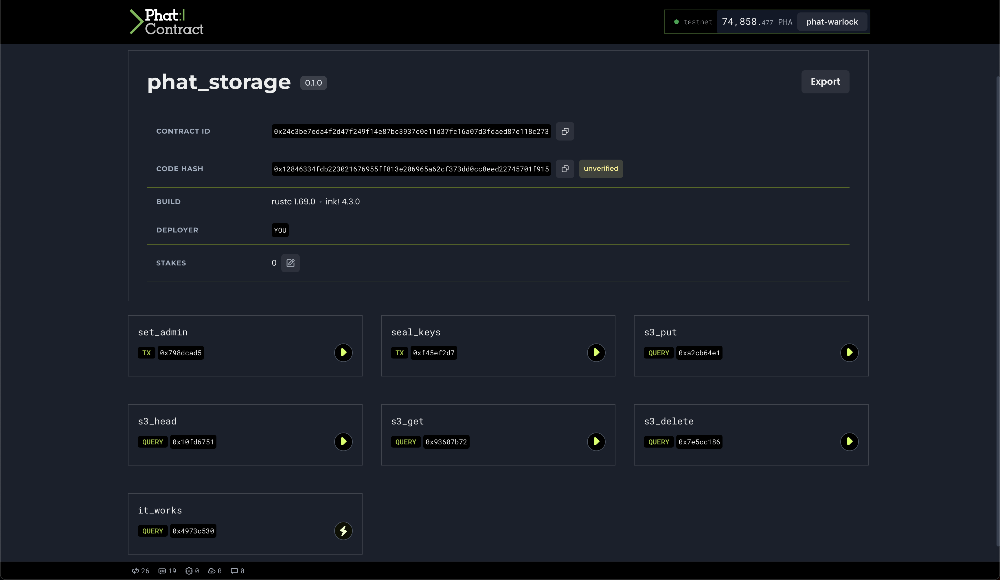

### Set Admin

Set a new admin for the contract with the `set_admin` function. Only the current admin can perform this operation.

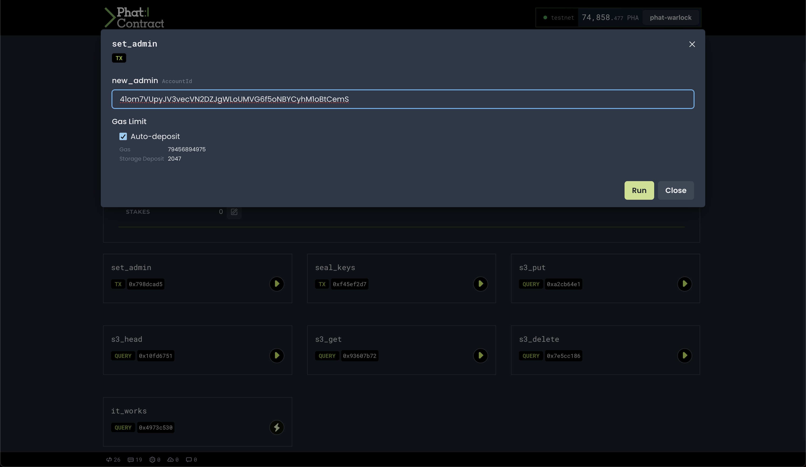

### Seal Keys

Seal the S3 Bucket access and secret keys with the `seal_keys` function. Only the admin can perform this operation.

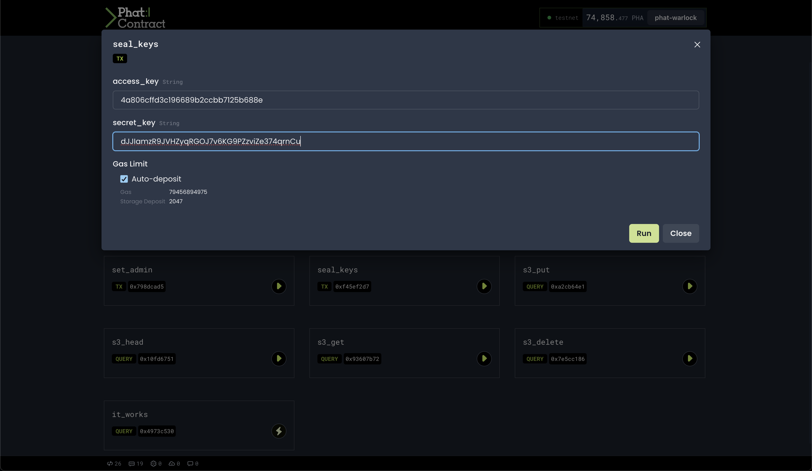

### S3 Operations

Perform `PUT`, `HEAD`, `GET`, and `DELETE` operations on an S3 bucket with the `s3_put`, `s3_head`, `s3_get`, and `s3_delete` functions respectively. Only the admin can perform these operations and the keys must be configured.

Let's go through a user journey.

#### S3 `PUT`
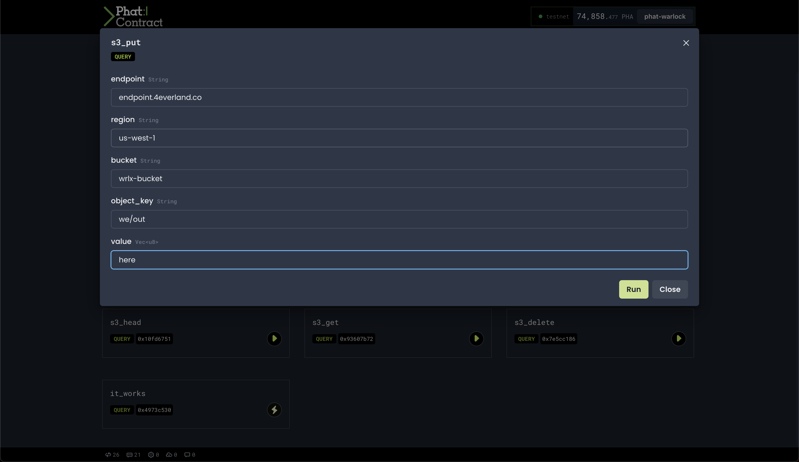

#### S3 `PUT` Result
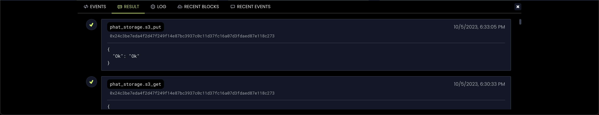

#### S3 `GET`
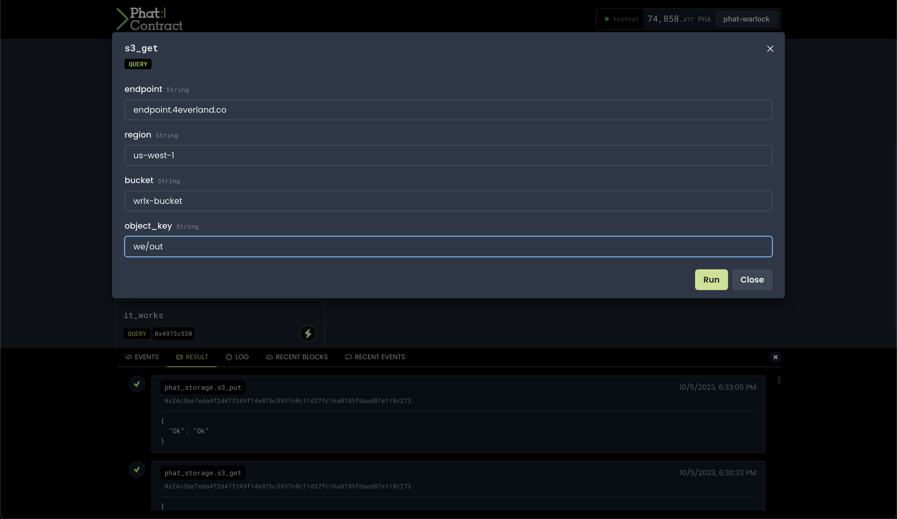

#### S3 `GET` Result
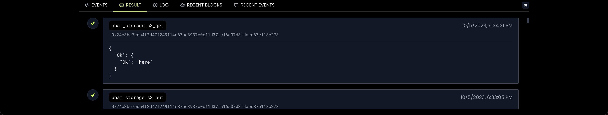

#### Check 4Everland UI Dashboard
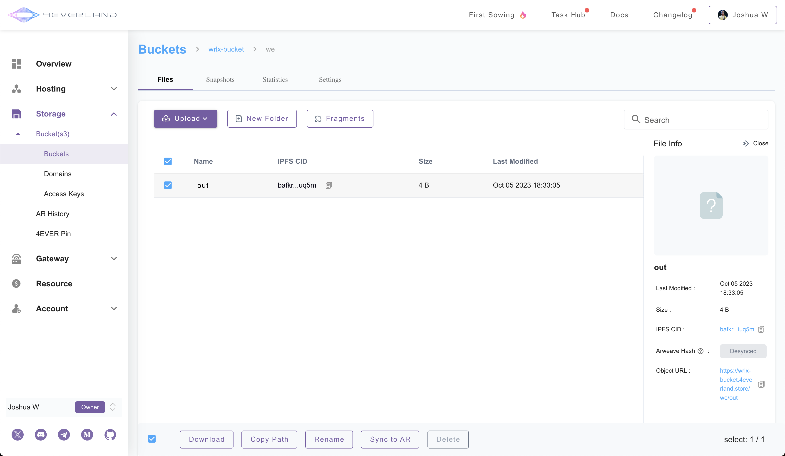

#### S3 `DELETE`
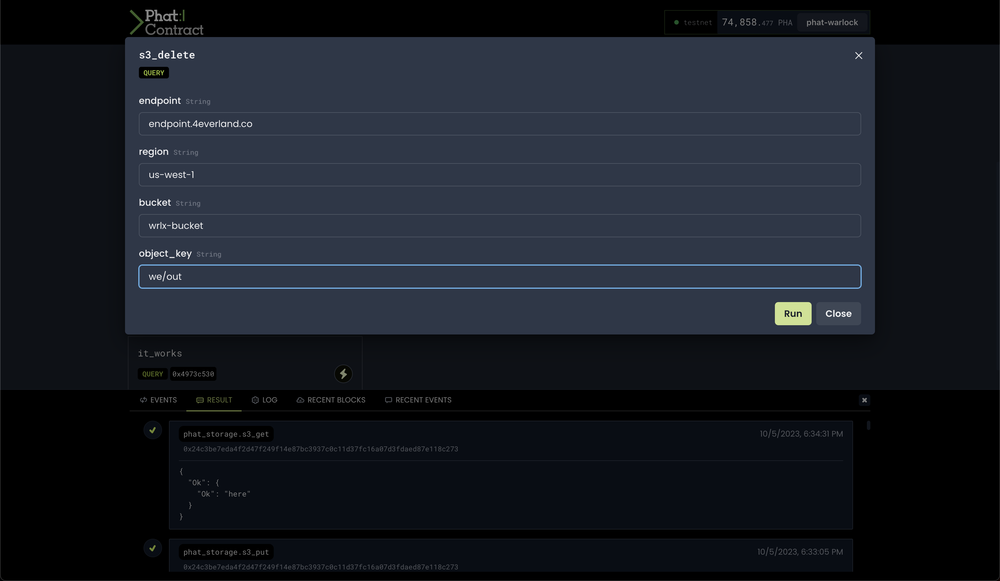

#### S3 `DELETE` Result
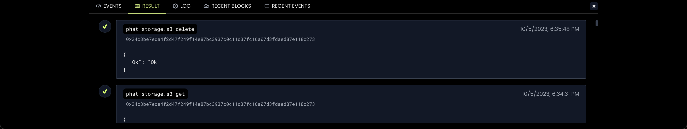

#### Check 4Everland UI Dashboard
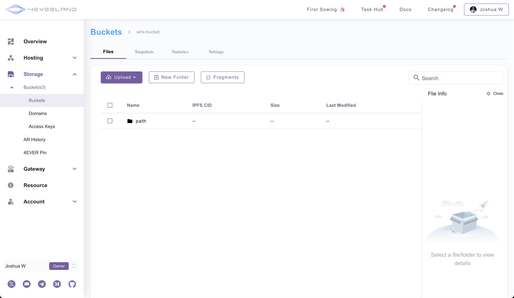

### Test the Contract

Test the contract with a predefined S3 bucket and object with the `it_works` function. In the Phat UI, you can click the 

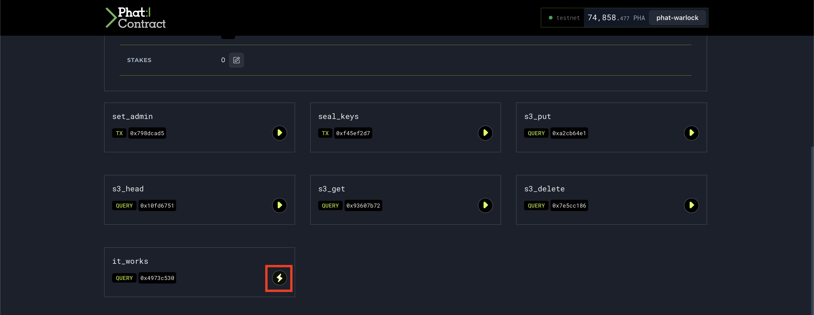

> Note: you will need to update the function to hardcode values to function correctly. If you have installed [`swanky phala`](https://github.com/Phala-Network/swanky-plugin-phala) and are running on a machine with x86 chip, you can execute the following:

```bash
swanky phala contract test -t phat_storage
```

## Errors

The contract can return the following errors:

- `NoPermissions`: The caller is not the admin
- `InvalidRequest`: The S3 operation failed
- `KeysNotConfigured`: The access and secret keys are not configured
